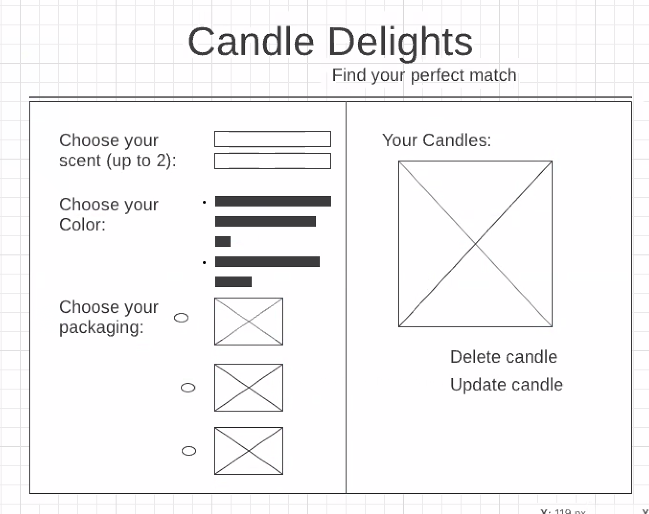

# Candle deLights
Find Your Perfect Match

## Table of Contents
* [Introduction](#introduction)
* [Collaborators](#collaborators)
* [Live Link](#live-link)
* [Technologies](#technologies)
* [Getting Started](#getting-started)
* [Wireframes](#wireframes)
* [User Stories](#user-stories)
* [Project Status](#project-status)
* [Unsolved Issues](#unsolved-issues)

## Introduction
Candle deLights is a candle-making application that allows users to customize their own candles and keep track of the candles they have made. With Candle deLights, users can choose up to two of their favorite scents, pick a color that speaks to them, and even personalize the packaging to display their candle.

This app was designed to be accessible by anyone; we wanted users to be able to interact with the application from computer browsers as well as their mobile options. We used drop down menu's to allow users to easily select their candle ingredient options to create a final product that they can add to their list. Once added, we added features like "edit" and "delete" so that users have the flexibility to tweak their inventions or to dwindle their list if it gets too long.

## Collaborators
* Becka Catanzaro
* Julie Fryer

## Live Link
https://candle-delights.herokuapp.com

## Technologies
* HTML / CSS
* Ruby
* Ruby on Rails
* JavaScript
* ReactJS
* Github
* Heroku

## [Getting Started](#getting-started)
1. Fork the repo and clone it to your local machine.
2. In your terminal, in this folder, run a bundle install.
3. In separate terminal windows, start Rails and PostgreSQL.
4. In PostgreSQL, create a database called “candle-delight_development”. Create a table called “candles” using the following code:

```
CREATE TABLE candles (id SERIAL, scent_1 VARCHAR(25), scent_2 VARCHAR(25), embellishment VARCHAR(25), color VARCHAR(25), packaging VARCHAR(25));
```

## [Wireframes](#wireframes)


## [User Stories](#user-stories)
* As a user, I should be able to create a candle using the pre-populated dropdowns and radio buttons. On hitting "Submit" my candle should be instantly visible on the page.
* As a user, I should be able to edit and delete my candle.
* As a user, I should be able to scroll through a list of my candles.
* As a user, I should be able to resize my window and be presented with a responsive design that allows me to easily see and access all parts of the page.

## [Project Status](#project-status)
As of this time, the project is complete. In future, we might revisit this app to deal with some of the issues below.

## [Unsolved Issues](#unsolved-issues)
* This is a single-use app. There is no user/password, which means that anyone can access it by clicking on the live link, and anyone can create, edit, and delete anyone else's candle. In future, we may add an authorization feature (username, password) so that users can only access, edit, and delete their own creations.
* We also would like to add a second database that contains candle allergen information based on scent, embellishment, and color. Users would then be able to toggle a button on each candle to reveal what allergens that candle contains, if any.
